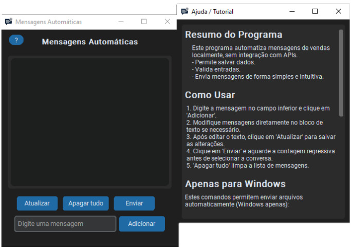

# Local Sales Message Automation

A local message automation application designed to simplify the process of sending repetitive sales messages.

This project focuses on **data validation, local persistence, and a simple graphical interface**, while keeping the entire process **local and independent from external APIs**.

The application was developed in Python and provides an intuitive interface for managing and sending messages efficiently.

> Note: The application's interface is currently available in **Portuguese (PT-BR)**.

---

# Demo

  

*A short demonstration of the application sending automated messages.*

---

# Features

- Local message automation
- Create, edit, and delete messages
- Input validation
- Persistent local data storage
- Graphical user interface
- Countdown before message sending
- Simple workflow for repetitive sales messages

---

# How It Works

The application allows users to prepare multiple messages and send them sequentially.

Messages are stored locally and can be edited at any time through the graphical interface.

When the application starts, it automatically creates a **data/** folder in the same directory as the executable to store persistent data.

No internet connection or external API is required for the automation process.

---

# How to Use

1. Type a message in the input field and click **"Adicionar" (Add)**.
2. Edit messages directly in the text block if needed.
3. After editing the content, click **"Atualizar" (Update)** to save changes.
4. Click **"Enviar" (Send)**.
5. Wait for the countdown before selecting the target conversation.
6. The **"Apagar tudo" (Clear All)** option removes all stored messages.

---

# File Sending Commands (Windows Only)

The application also supports file sending commands on Windows systems.

These commands allow automatic file delivery through the message automation workflow.

---

## Send a Single Image
`/enviar_imagem C:\Caminho\da\imagem.png`
Description:

- Sends a single image file
- Supported formats include `.png`, `.jpg`, `.jpeg`

---

## Send All Files From a Folder
`/enviar_pasta C:\Caminho\da\pasta`
Description:

- Sends all files contained in the specified folder
- Supports most common file formats

---

# Platform Compatibility

Message automation works on:

- Windows
- Linux
- macOS

However, **file sending commands are supported only on Windows**.

---

# Windows Security Notice

When running the executable for the first time on Windows, **SmartScreen may display a warning**.

If this happens:

1. Click **More Info**
2. Click **Run Anyway**

This is common for standalone executables that are not digitally signed.

---

# Installation

Download the latest version from the **Releases** section.

The application is distributed as a **standalone executable**, meaning no additional configuration or dependencies are required.

After launching the program for the first time, a **data/** folder will be created automatically in the executable directory.

---

# Tech Stack

- Python
- Tkinter (GUI)
- Local file persistence
- Standalone executable packaging

---

# Project Goals

This project was developed to practice and demonstrate:

- Graphical interface development
- Local automation tools
- Data validation techniques
- Persistent local storage
- Code organization for small automation applications

---

# Screenshot

  

---

# Disclaimer

This software is intended for **educational and legitimate use only**.

Users are responsible for how they use the automation features.

---

## License

This project is licensed under the MIT License - see the [LICENSE](LICENSE) file for details.
